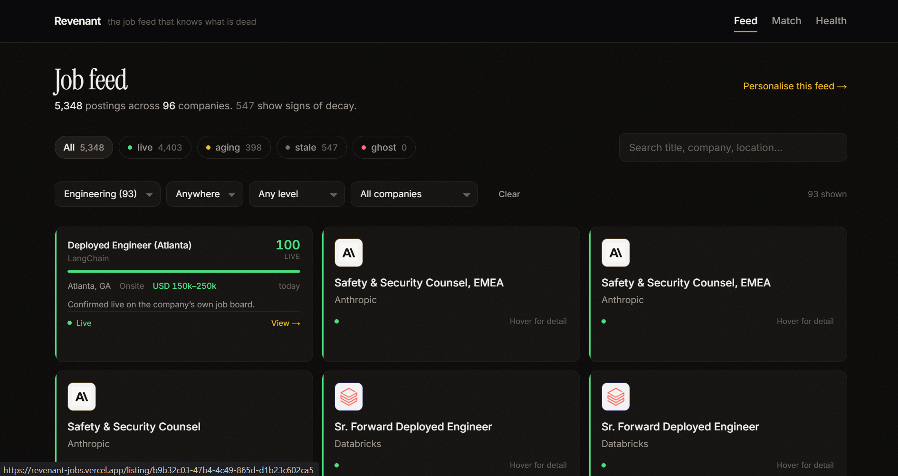
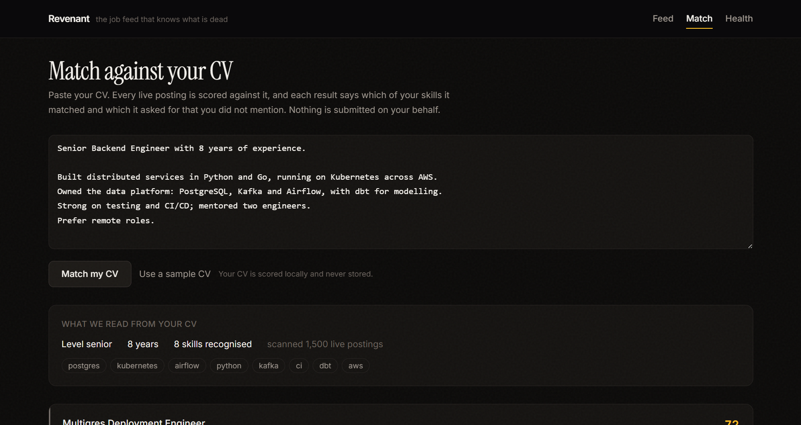
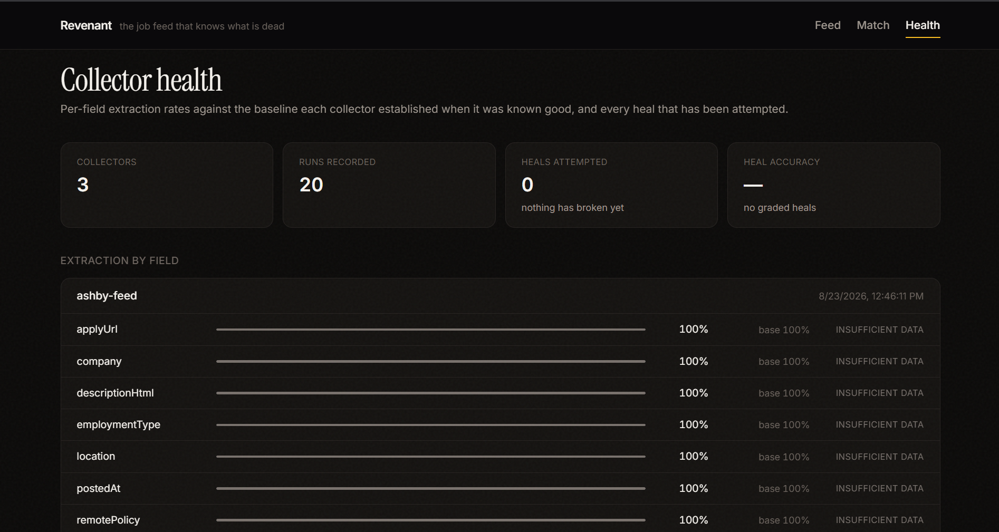
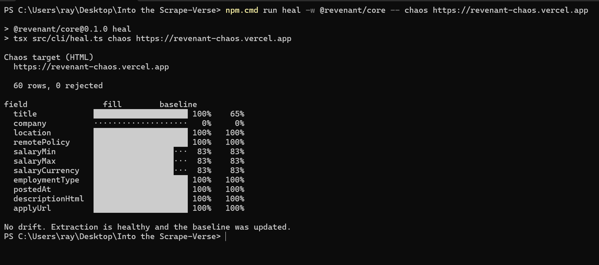

# Revenant

**A job feed that tells you which listings are already dead.**

Live demo → **https://revenant-jobs.vercel.app** (no login, no signup)
Built for [Into the Scrape-Verse](https://www.wemakedevs.org/hackathons/scrape-verse), Aug 2026.



| | |
|---|---|
|  |  |
| **Match** — roles ranked against a CV, naming the skills you are missing | **Health** — per-field extraction against each collector's baseline |

---

## What it does

Job boards go stale and nobody measures it. A role gets filled, but the listing
stays up for months. The same job shows up on five different boards. And when a
site changes its HTML, a field silently starts returning nothing.

**The important bit: I do not scrape LinkedIn or Indeed.** Those are aggregators —
they hold a *copy* of a posting, and nobody tells them when it comes down. So I
scrape the companies directly, through the systems they actually run hiring on:
Greenhouse, Lever and Ashby. That is the source rather than a copy of it, and it
is what makes everything below possible.

Revenant scrapes those boards with Bright Data Scraper Studio and scores every
listing on whether it is still real:

- **Ghost detection.** We scrape the aggregator *and* the company's own careers
  board. If a role is gone from the company's board but still listed elsewhere,
  it is dead — and we can prove it rather than guess.
- **Salary that the API does not have.** Greenhouse's JSON feed has no
  compensation field at all: 0 out of 3,509 postings. Scraper Studio pulls the
  range out of the job description text instead — 43 of 50 on Vercel's board.
- **Self-healing that gets checked.** When a heal is proposed, we re-run the
  scraper and compare the result against the ATS platform's own feed before
  accepting it.
- **CV matching.** Paste a CV, get roles ranked by fit, with the exact skills you
  are missing named. It never applies for you.

---

## How I used Bright Data Scraper Studio

I described the data I wanted in one paragraph of plain English, and Scraper
Studio built the scraper. No CSS selectors, no XPath — just what each field *is*:

> Every job posting on this board. For each: the job title as displayed; the
> hiring company name; where the role is based as written; whether it is remote,
> hybrid or on-site; **the advertised salary range with its currency if stated
> anywhere in the posting including the description text**; the employment type;
> the date it says it was posted; the full job description; and the link a
> candidate follows to apply.

That bolded phrase is the whole trick. Job boards put *"Competitive compensation
package"* in their salary field and hide the real number further down the page in
prose. Asking for it "anywhere in the posting" is what finds it.

The same paragraph is reused for Greenhouse, Lever and Ashby. Three completely
different page structures, one description — that is the part I could not have
built by hand in a week.

**I pointed it at the rendered HTML, not the JSON APIs these platforms publish.**
Two reasons. Greenhouse's API has no salary field at all, so the page contains
data the API cannot give me. And an API that never changes shape gives
self-healing nothing to do.

The APIs are still used — but as a **reference to check the scrape against**,
never as the source.

### What it produced

Collector `c_msyq5cea136y76lhb0` against Vercel's board, in 4.6 minutes:

```
50 rows returned, 0 rejected

  title            100%      salaryMin         86%   ← the API has 0%
  location         100%      postedAt           0%   ← not shown on the index
  descriptionHtml  100%      applyUrl         100%

accuracy vs Greenhouse's own feed:  80% overall, 100% on every field the page shows
```

Sample output: [`docs/sample-output.json`](docs/sample-output.json)

### When the page changed

I built a job board I control, deployed it, pointed a collector at it, and then
redesigned it at the **same URL** — every class renamed, the salary nested and
split across three elements.



```
baseline (layout A)   60 rows · location 100% · salary 83%

  ── board redesigned, same URL ──

collector run         0 rows
detector              "returned nothing where previous runs averaged 33 rows"
heal requested        Scraper Studio returns a preview at the approval gate
graded, then approved
collector re-run      60 rows, 0 rejected
after                 location 100% · salary 83% · title 100%
```

`title` was 0% before the heal and 100% after — the repair recovered a field the
original collector never managed to extract.

**The one thing I did differently:** `bdata scraper heal` proposes a fix and waits
for approval, and I never pass `--auto-approve`. Auto-approving means trusting a
fix because the thing that wrote it says it works — but a heal can latch onto the
wrong element, refill the field perfectly, and return a job's department where its
location used to be. Fill rate looks fine. The data is wrong.

So the gate is left closed. It hands back the rows the fix *would* produce, those
get checked against the platform's own feed, and only then is it approved.

Running it live also broke two of my own assumptions, which is in
[the healing notes](#two-things-worth-reading-the-code-for).

### 4. Where the data goes

Collector → normalise → dedupe → SQLite → Next.js app. The collector ID is the
integration point: `npm run ingest` pulls a board, and the site reads from the
database.

**Why scrape HTML when these platforms have a JSON API?** Two reasons. The API
has no salary field, so scraping the page gets data the API cannot give you. And
an API that never changes shape gives self-healing nothing to do — the whole
point of the hackathon.

The JSON feeds are still used, but as a **reference to check the scrape against**,
never as the data source.

---

## Numbers

All from `npm run db:stats`, not estimates.

```
3,509 postings   from 15 company boards
  live   2,053
  aging    376
  stale  1,080
108 duplicates collapsed

salary via ATS API:            0 / 3,509    (0%)
salary via Scraper Studio:    43 / 50       (86%)
accuracy vs ground truth:     80% overall, 100% on every field the page shows

135 tests
```

---

## Two things worth reading the code for

### 1. Empty is not the same as broken

The obvious way to detect a broken scraper is to alert when a field comes back
empty. That does not work on job boards, because most postings genuinely do not
list a salary. Alert on empty and it fires constantly until you mute it.

So Revenant compares each field against what *that collector* usually returns:

```
same run, zero salaries found:
  usually 0.5% → fine      (this board never had salary)
  usually 40%  → broken    (extraction just died)
```

[`healing/baseline.ts`](packages/core/src/healing/baseline.ts)

### 2. A heal is checked before it is trusted

Fill rate cannot tell a good fix from a confident wrong one. Ground truth can.

```
heal proposed → read the gate's preview → compare against the platform's own feed
                                              ├─ good → approve
                                              └─ otherwise → reject
```

Running this live broke two assumptions I had written into it.

**Drift could not see total failure.** Drift is measured per field *across rows*,
so a run that returns no rows produces no evidence about any field — every one
reports "insufficient data". The first real redesign broke extraction completely
and the loop printed *"No drift. Extraction is healthy."* The worst possible
failure was the only case it could not see. Row count is now judged on its own.

**Grading a re-run rejects every heal.** I had it ask for a fix, then re-run the
collector to score it. But a proposed fix is not live until approved, so the
re-run returns the *old* scraper's output — always. The first genuine heal got
rejected for being correct. The gate returns the rows the fix would produce, and
that is what gets graded.

[`healing/orchestrator.ts`](packages/core/src/healing/orchestrator.ts) ·
[`healing/audit.ts`](packages/core/src/healing/audit.ts) ·
[`healing/baseline.ts`](packages/core/src/healing/baseline.ts)

---

## Ghost detection

A ghost job is live but not real. Aggregators cannot tell, because the only thing
they know is that the listing is still on their own page.

We read the company's own board too. If the role is gone from there but still
listed elsewhere, the company itself stopped listing it.

| Signal | Weight |
|---|---|
| Gone from the company's own board | **proof** |
| Apply link no longer works | high |
| Age (gentle under 30 days, steep over 90) | high |
| Re-posted repeatedly with a fresh date | medium |
| Description never changes | low |

**`ghost` requires proof.** A 2,000-day-old listing with a dead apply link scores
0 and is still only marked `stale`. Telling someone a real job is dead costs them
an opportunity, so that word is reserved for cases we can back up.

Every score comes with its reason:

> *"Removed from the company's own job board 12 days ago, but still listed here."*

[`decay/liveness.ts`](packages/core/src/decay/liveness.ts)

---

## Finding company boards cheaply

Crawling to *find* career pages means loading a lot of empty pages. ATS boards
have predictable URLs instead, so we generate candidate slugs from a company name
and check them against the platform's free feed before any scraper runs.

```
$ npm run discover -w @revenant/core -- --file companies.txt

greenhouse  572 roles  https://job-boards.greenhouse.io/stripe
ashby       136 roles  https://jobs.ashbyhq.com/ramp
greenhouse  810 roles  https://job-boards.greenhouse.io/databricks
...
17/18 companies resolved, 2852 open roles, 2.4s
```

Zero Bright Data credits spent. This finds roles that only exist on a company's
own board and never reach an aggregator.

---

## Running it

Node 22+. No Docker, no external database.

```bash
npm install
npm run db:push -w @revenant/core
npm run ingest  -w @revenant/core -- --file companies.txt
npm run dev
```

Open http://localhost:3000. A sample database is committed, so it works before
you ingest anything.

For the Scraper Studio collectors, add a Bright Data key to `.env` (copy
`.env.example`).

| Command | What it does |
|---|---|
| `discover` | Find company boards |
| `ingest` | Fill the database |
| `scraper:create` | Build a Scraper Studio collector |
| `collect` | Run a collector, print fill rates and accuracy |
| `heal` | Detect drift, heal, grade, approve or reject |
| `db:stats` | What is in the database |

---

## Architecture

```
Bright Data Scraper Studio          one plain-English field spec
  rendered board HTML               proxies, retries, unblocking, self-heal
        │
        ▼
  collect → normalise → dedupe → store
     │
     ├── drift check: fill rate vs this collector's baseline
     │      └── dropped? → heal → grade vs ATS feed → approve / reject
     │
     └── decay check: still on the company's board? → liveness score
        │
        ▼
  SQLite  →  Next.js
```

```
packages/core/
├── brightdata/   bdata CLI wrapper (create, run, heal, approve)
├── collectors/   the board collector
├── healing/      baselines, drift detection, grading, orchestration
├── decay/        liveness scoring and ghost detection
├── discovery/    company → board lookup
├── match/        CV matching
├── normalize/    dedupe, salary parsing
├── oracle/       ATS feeds used as reference
└── db/
apps/web/         feed, match, listing, health
apps/chaos-target/  a board we can break on purpose, to test healing
```

---

## What it does not do

- **No auto-apply.** It never submits anything for you.
- **Public data only.** Public ATS boards. No logins, no paywalls, no government
  sites, no personal data.
- **No account.** Your CV stays in your browser and is scored in memory. Nothing
  is stored server-side.
- **Not built yet:** the Ashby collector, and email digests.

---

## AI disclosure

Built with Claude Code (Claude Opus 5), as the rules allow. I directed the
architecture and the design decisions; the numbers in this README all came from
running the code.

MIT licensed.
